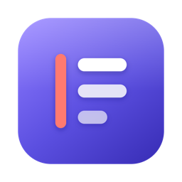

<p align="center"></p>

# Margin

A fast, local-first note-taking app. Every note is a plain markdown file in a folder on your disk. There is no database.


- **[User guide](docs/user-guide.md)** ([HTML](docs/user-guide.html)): everything the app does, with recommended workflows.
- **[Theory of operations](docs/operations.md)** ([HTML](docs/operations.html)): the routine to follow each morning, meeting, day, week and month.
- **[Product specification](docs/specification.md)** ([HTML](docs/specification.html)): everything the app does, written so it could be built again from scratch.
- **[Design and development flow](docs/design.md)** ([HTML](docs/design.html)): how it is built and how to change it.

## Run it

```bash
npm install
npm run app
```

That builds Margin and opens it as a desktop app. The first run creates a `vault/` folder with a few starter notes.

To run it in a browser instead, `npm run dev` serves it at http://localhost:4321 and reloads as the code changes; `npm start` builds once and serves the optimised version.

## Tasks from the command line

`tools/margin_tasks.py` lists the tasks in your notes from a terminal: the same lists as the app, with filters and JSON output. It is read-only and needs only Python 3.8 or newer.

```bash
python3 tools/margin_tasks.py today
python3 tools/margin_tasks.py open --tag atlas --priority p2 --json
```

In the installed app, **Help → Command-Line Tool…** installs it as `margin-tasks` in `~/.local/bin` (no password needed). See "Tasks from the command line" in the user guide for every option.

## Desktop app

The same app also runs as a desktop app (Electron) with its own window, a menu bar, standard shortcuts (⌘N, ⌘W, ⌘,), a notes-folder picker, direct PDF export and a system-wide quick-capture hotkey (Ctrl+Alt+Space).

```bash
npm run app
```

To build an installable app for the platform you are on:

```bash
npm run app:dist
```

The result is written to `release/`. `npm run app:pack` builds just the unpacked app, which is quicker. Builds are unsigned.

Run from this folder, the desktop app uses `./vault`. An installed copy uses `~/Documents/Margin` until you pick another folder with File → Choose Notes Folder.

## Browser settings

| Setting | Default | How to change |
| --- | --- | --- |
| Notes folder | the folder chosen in the desktop app, else `./vault` | `VAULT_DIR=~/Notes npm start` |
| Port | `4321` | `PORT=5000 npm start` |

The server only listens on `127.0.0.1`.

## What is in it

- **Pages** in markdown with tables, task lists, code highlighting, LaTeX math (`$inline$` and `$$display$$`), and pasted or dropped images, PDFs and files.
- **Daily notes and a calendar.** Each day has a page and an infinite canvas of cards. Any note can have a canvas.
- **Search and switching** with ⌘K: full-text search, `#tag` filters, recent notes, and commands. Open notes stay in tabs.
- **Quick capture** (⌥C) into today's note, a scratch note, or an Inbox note.
- **Scratch notes** that expire after a week unless you keep them.
- **Research notes** with a source link, a reading status, and sections for quotes and your own notes.
- **Backlinks.** Link with `[[Note title]]`; the side pane shows what links here, unlinked mentions, outgoing links and an outline. Renaming a note updates links to it.
- **Version history** with a diff view and one-click restore.
- **Export** to Markdown, HTML, PDF (through the print dialog), a Word file, or rich text on the clipboard for Google Docs.
- **Notebooks** (folders, nested), tags (frontmatter or inline `#tags`), and pinned notes.
- Light and dark themes. Press `?` for the full shortcut list.

## How notes are stored

```
vault/
  Welcome to Margin.md        a note; the file name is the title
  Work/Atlas plan.md          notebooks are folders
  Daily/2026-10-06.md         daily notes
  attachments/                images, PDFs and other files
  .history/<note id>/         version snapshots, one per 5 minutes of editing
  .trash/                     deleted notes and expired scratch notes
```

A note looks like this:

```markdown
---
id: 3f9a1c20be
tags: [atlas, plan]
pinned: true
created: '2026-10-01T09:12:00.000Z'
updated: '2026-10-06T08:30:00.000Z'
---
The page content, in ordinary markdown.

<!-- canvas -->
<!-- card id=c1 x=0 y=0 w=280 h=170 color=amber -->
Each canvas card is markdown too.
<!-- /card -->
<!-- edge from=c1 to=c2 -->
```

You can edit the files in any other editor, or drop existing `.md` files into the vault. Margin picks up changes when its window regains focus. Frontmatter keys it does not know are left alone.

## Notes on export

- **PDF** saves straight to a file in the desktop app. In a browser it uses the print dialog: choose "Save as PDF".
- **Google Docs** has no direct upload, because that would need a Google account connection. Use "Copy for Google Docs" and paste into a new document, or upload the Word export to Drive. In both, math is exported as its LaTeX source.

## Code layout

- `server/index.mjs` — the file-backed API (notes, folders, attachments, history).
- `electron/` — the desktop shell: window, menus, folder picker, PDF export.
- `src/store.ts` — app state, autosave, routing.
- `src/components/` — the views: editor, canvas, calendar, lists, palette.
- `src/lib/` — markdown rendering, canvas format, links and backlinks, search, export.
