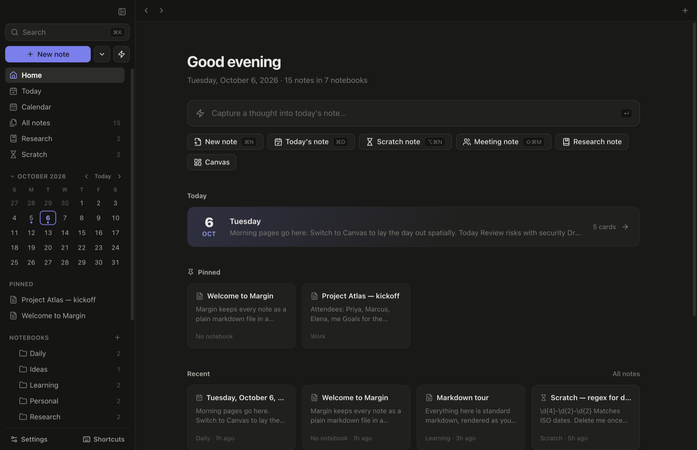

# Margin user guide

Margin is a note-taking app for people who keep a lot of notes: work, meetings, research, things to learn, and quick ideas. Every note is a plain markdown file in a folder on your computer. There is no database and no account.



You can open this guide from inside the app: **Help → User Guide** in the menu bar, the **User guide** button in the shortcuts window (press `?`), or type "guide" in ⌘K. The [design guide](design.md), which explains how Margin is built, is in the same places.

This guide uses the desktop app's shortcuts. In a browser, most use ⌥ in place of ⌘ (see [Shortcuts](#shortcuts)). Every shortcut can be changed in Settings.

## Contents

- [Getting started](#getting-started)
- [The window](#the-window)
- [How Margin is organised, and why](#how-margin-is-organised-and-why)
- [Writing](#writing)
- [Finding things](#finding-things)
- [Daily notes, the calendar and the canvas](#daily-notes-the-calendar-and-the-canvas)
- [Tasks](#tasks)
- [Quick capture and scratch notes](#quick-capture-and-scratch-notes)
- [Meeting notes and templates](#meeting-notes-and-templates)
- [People and 1:1s](#people-and-11s)
- [Research notes](#research-notes)
- [Organising](#organising)
- [Two notes side by side](#two-notes-side-by-side)
- [History, trash and export](#history-trash-and-export)
- [Importing from Obsidian](#importing-from-obsidian)
- [Settings](#settings)
- [Shortcuts](#shortcuts)
- [Recommended workflows](#recommended-workflows)
- [Where your notes live](#where-your-notes-live)
- [If something goes wrong](#if-something-goes-wrong)

## Getting started

You need [Node.js](https://nodejs.org) 20 or newer.

```bash
npm install
npm run app
```

`npm run app` builds Margin and opens it as a desktop app. The first run creates a `vault` folder with a few example notes.

| Command | What it does |
| --- | --- |
| `npm run app` | Build and open the desktop app |
| `npm run dev` | Run in a browser at http://localhost:4321, reloading as the code changes |
| `npm start` | Build once and serve in a browser |
| `npm run app:dist` | Build an installer for the system you are on, into `release/` |

To use a different notes folder, choose **File → Choose Notes Folder** in the desktop app. The browser version opens the same folder the desktop app uses; to give it a different one, start it with `VAULT_DIR=~/Notes npm start`.

## The window

- **Sidebar** on the left: search, the New note button, Home, Today, Journal, Calendar, All notes, Tasks, Research, Scratch, a small calendar, your pinned notes, the five notes you opened most recently, notebooks and tags. ⌘\ hides it. Drag its right edge to make it wider or narrower; double-click the edge to go back to the usual width.
- **Tabs** along the top: every note you open stays in a tab. ⌘⇧[ and ⌘⇧] move between them, ⌥1–9 jump to one, ⌘W closes one.
- **The note** in the middle, with its title, tags, a formatting toolbar and the text.
- **The side panel** on the right of a note: backlinks, unlinked mentions, outgoing links, an outline and file details. ⌘. hides it.

**Home** shows today's note, your pinned notes, recently opened notes, your reading queue and scratch notes that are about to expire.

Back and forward work as in a browser: ⌘[ and ⌘], the mouse's back and forward buttons, or the arrows at the left of the tab bar.

## How Margin is organised, and why

Margin has a handful of ways to organise notes. This chapter explains what each is for, why it exists, and which ones you can ignore.

### The short version

- A **notebook** says where a note lives. A note is in exactly one.
- A **tag** says what kind of thing a note is. A note can have many.
- A **link** says what a note is related to. It is the most specific of the three.
- **Search** finds everything else.

If you only remember one thing: put notes in a few broad notebooks, link generously, and let search and backlinks do the rest.

### Notebooks

**What they are.** A notebook is a folder inside your notes folder. `Work/Atlas plan.md` is a note called "Atlas plan" in the notebook "Work".

**Why they exist.** Every note is a file, and a file has to be in some folder. Notebooks are simply those folders, shown in the sidebar. They are not a feature added on top; they are what the files already are. That is also why they keep working outside Margin: open the notes folder in Finder and the notebooks are right there.

**What they are good for.**

- Separating areas of your life that rarely mix: Work, Personal, Learning.
- Keeping generated notes out of the way: Daily, Meetings, Scratch and Templates are notebooks Margin files things into for you.
- Scoping a list. Clicking a notebook shows only what is in it.

**What they are bad at.** A note can only be in one notebook, but most notes belong to several topics. A meeting about the Atlas project with a vendor is "Meetings", "Atlas" and "Vendors" all at once. Trying to express that with folders leads to deep trees and time lost deciding where things go.

**How to use them well.**

- Keep to a handful, by broad area. Five to seven is plenty for most people.
- Avoid nesting more than one level, except where Margin does it for you (Meetings by year and month).
- If you cannot decide where a note goes, leave it at the top level or in the Inbox. It is still found by search, links and tags.
- Use tags and links for topics, projects and people.

### Tags and links

**Tags** answer "what kind of note is this?" or "what state is it in?": `#meeting`, `#idea`, `#question`, `#todo`. They cut across notebooks, and a note can carry several.

**Links** answer "what is this about?". Writing `[[Atlas]]` in a meeting note connects the two, and the Atlas note's backlinks then list every note that mentions it. This is what replaces deep folder trees: you do not file the meeting under Atlas, you mention Atlas in it.

| To say | Use | Example |
| --- | --- | --- |
| Where it lives | Notebook | Work |
| What kind of thing it is | Tag | `#meeting` |
| What it relates to | Link | `[[Atlas]]`, `[[Priya]]` |
| That I need it close at hand | Pin | |

### The kinds of note

Every note is an ordinary markdown file. A few kinds get extra behaviour, switched on by one line at the top of the file. Remove that line and it is a plain note again.

| Kind | What it adds | Why it exists |
| --- | --- | --- |
| **Daily note** | Named for its date, shown on the calendar, one key to open today's, the default place captures land | You need somewhere to write when you do not yet know where something belongs. The date is a name you never have to think of. |
| **Scratch note** | An expiry date; it moves to the trash by itself | Much of what you jot down is only needed for a few days. Without an expiry, it piles up and buries the notes that matter. |
| **Research note** | A source link, a status (Unread, Reading, Done), a list filtered by status, a reading queue on Home | To keep a source and your thinking about it together, and to see what you have not finished reading. |
| **Meeting note** | Nothing special in the file. It is a plain note made from a template, filed by date, tagged `#meeting` and linked from that day | Meetings happen often and always have the same shape, so making one should take one keystroke. |
| **Canvas** | Not a kind of note: every note has a page and a canvas | Some thinking is spatial. |

### Do you need research notes?

No. Be honest with yourself about whether you would use the reading status.

A research note is a normal note with two extra fields. Its whole value is the queue: seeing at a glance what is unread, what you are part-way through, and what is done. If you collect articles, papers or documentation and want to track your way through them, that is useful.

If you do not, ignore the Research section entirely. An ordinary note with the link pasted in, and perhaps a `#reading` tag, does the same job with less ceremony. Nothing else in Margin depends on research notes.

The same goes for scratch notes and the canvas. They cost nothing if unused.

To take a section you do not use out of view, switch it off in **Settings → General → Sidebar sections**. That hides it from the sidebar and from Home. The notes themselves are untouched and still turn up in search.

### What you cannot skip

Only two things are structural:

- **The notes folder**, because that is where the files are.
- **Titles**, because links go by title. Two notes with the same title make a link ambiguous, so keep titles distinct.

Everything else is optional.

## Writing

### Live preview

Notes render as you type. The line your cursor is on shows its markdown; every other line shows the result. So `**bold**` becomes **bold** when you move off the line.

The buttons at the top right of a note switch between three modes:

- **Write** (live preview), the default
- **Markdown source**, the raw text
- **Read**, a read-only page. ⌘E switches between Write and Read.

### What you can write

| To get | Type |
| --- | --- |
| Heading | `# `, `## `, `### ` at the start of a line |
| Bold, italic, strikethrough | `**bold**`, `*italic*`, `~~struck~~` |
| Bulleted or numbered list | `- item` or `1. item` |
| Task | `- [ ] task`; click the box to tick it |
| Quote | `> quote` |
| Inline code, code block | `` `code` ``, or three backticks and a language on their own line |
| Link to a note | `[[Note title]]` |
| Web link | `[text](https://example.com)`, ⌘L, or just paste the address |
| Tag | `#tag` anywhere in the text |
| Inline math | `$e^{i\pi} + 1 = 0$` |
| Display math | `$$` on its own line, the formula, `$$` on its own line |
| Table | `/table`, or write it in markdown |
| Divider | `---` on its own line |

Code blocks are coloured for the language you name. Math uses LaTeX syntax.

### Slash commands

Type `/` at the start of a line or after a space. A menu appears; keep typing to narrow it and press Enter.

- **Blocks:** Heading 1–3, Bulleted list, Numbered list, Task, Quote, Text. These change the line you are on and keep its text.
- **Insert:** Code block, Table, Math block, Inline math, Divider, Link to a note, Web link, Image or file.
- **Dates:** Today, Tomorrow, Yesterday (links to that day's note), Date, Time.
- **Templates:** one entry per template; it inserts the template's text.

### Headings

⌘1 to ⌘5 turn the current line into a heading of that level. Pressing the same one again turns it back into plain text, and a different one changes the level. With several lines selected, each becomes a heading.

### Lists

- **Tab** nests an item under the one above. **⇧Tab** moves it back out. Numbering fixes itself.
- **⌥↑** and **⌥↓** move an item up or down past its neighbour, taking its sub-items along.
- **⌘⇧8**, **⌘⇧7**, **⌘⇧9** turn lines into a bulleted, numbered or task list, and back.
- **⌃A** goes to the start of the text; pressed again, to the very start of the line.

Nested levels show a faint guide line. The indent width and the guides are in Settings → Appearance.

### Tables

Tables are edited in place. Click a cell and type.

- **Tab** and **⇧Tab** move between cells; **Enter** moves down. Both add a row at the end.
- The **+** bars on the right and bottom edges add a column or a row.
- **Right-click** a cell to insert or delete rows and columns, set alignment, or **sort** the table by that column, A to Z or Z to A. You can also sort from the header: hover a column's heading and click the arrow at its right edge; click again to reverse. The arrow stays visible on the column the table is currently sorted by. Numbers sort as numbers, and empty cells go to the bottom. Sorting reorders the rows in the note itself; ⌘Z undoes it.
- **Width:** a table is only as wide as its contents need. To stretch every table across the page instead, choose Full width in Settings → Appearance → Table width.
- **Edit markdown** (top right, on hover) shows the raw table. Click **Done**, or move the cursor out, to return.

**Working with a spreadsheet.** For anything more than a small table, edit it in Google Sheets, Excel or Numbers and bring it back:

- **From a spreadsheet:** select the cells, copy, and paste into a note. They become a markdown table. The first row is the header, and a column that holds only numbers is right-aligned. Tables copied from a web page work the same way.
- **To a spreadsheet:** hover the table and click **Copy for spreadsheet**, then paste into the sheet. The cells arrive as cells.
- **Round trip:** copy the table out, edit it in the sheet, copy it back, and paste it over the old one (use **Edit markdown** and select the old table first, or delete it and paste).

In the file, every table is written with its columns padded so the pipes line up in a fixed-width font, in markdown source mode and in any other editor:

```
| Block   | Owner   | Power (mW) |
| ------- | ------- | ---------: |
| Mempath | Shankar |         30 |
| LPCM    | Priya   |      1,200 |
```

Formulas come across as their results, and formatting such as colours, bold and merged cells is dropped. Pasting inside a code block is left as plain text.

### Images and files

Paste or drop an image, PDF or any file into a note. It is saved in your attachments folder and linked from the note.

- **Click** an image to see it larger. Esc closes it.
- **Edit**, a small button on hover, shows the image's markdown.
- **Size:** a pasted Retina screenshot is shown at the size it was on screen. The width is the number after `|` in the markdown, for example ``. Change or remove it to resize.
- **Names:** a pasted image is named after the note and the time, for example `Atlas-kickoff-2026-10-06-1654.png`.
- **Border:** Settings → Appearance → Image border offers None, Hairline or Shadow.

### Links

- Type `[[` and pick a note. Typing a date phrase works too: `[[tomorrow`, `[[next friday`.
- Click a link to open it. ⌘-click opens it in the other pane.
- A link to a note that does not exist yet is shown outlined; clicking it creates the note.
- To edit a link, put the cursor on its line first; then a click places the cursor and ⌘-click opens.
- Renaming a note updates every link to it.
- **Web links:** ⌘L inserts `[]()` with the cursor between the square brackets, ready for the link's text. With words selected it wraps them and puts the cursor in the round brackets for the address.
- **Short links:** company short links written as plain text are clickable as they stand: `go/some-name`, `b/1234567` and `b/hotlists/1234567`. Clicking one opens `http://go/some-name` (or `http://b/…`) in your browser. The text in the note is not changed. They are recognised in the editor, read mode, canvas cards and the Tasks view, but not inside code, web addresses or existing links. Turn this off in Settings → Editor → Short links.
- **Paste to link:** select some words and paste a web address. The words become a link to it. This does not happen inside code or an existing link.

### Right-click

In the desktop app, right-clicking in a note offers spelling suggestions, Cut, Copy and Paste, Look Up, "Search Notes for…", and Format, Paragraph and Insert menus. Right-clicking a link offers Open, Open to the Side and Copy Link.

## Finding things

### Search everything: ⌘K

⌘K opens one box that searches, switches notes and runs commands.

- **Empty:** recently opened notes. The first is the note you were in before, so ⌘K then Enter flips between two notes.
- **Words:** full-text search across all notes. Opening a result scrolls to the match.
- **`#tag`:** only notes with that tag.
- **A date:** `today`, `tomorrow`, `friday`, `next monday`, `last friday`, `06/10`, `6 oct`, `in 3 days`. The first result is that day's daily note.
- **A command:** type what you want to do. `rename`, `delete`, `duplicate`, `close other`, `add tag`, `copy link`, `export`. A matching command appears at the top; press Enter.
- **`>`:** commands only.
- **⌥↵** opens the selected note in the side pane. **⌘↵** creates a note named with what you typed.

Commands act on the note in the active pane. The ones people reach for most:

| Type | Does |
| --- | --- |
| `rename` | Rename this note (also F2). Links to it are updated. |
| `delete` | Move this note to the trash, with Undo |
| `duplicate` | Make a copy |
| `add tag` | Add one or more tags |
| `copy link` | Copy `[[Title]]` to paste into another note |
| `close other` / `close all` | Close the other tabs, or all of them |
| `move` | Move to another notebook |
| `open to the side` | Show this note in the side pane |
| `history`, `export` | Version history; export as PDF, Markdown, HTML or Word |
| `theme`, `settings`, `page width` | Change how the app looks |

### Search inside a note: ⌃S

⌃S opens a small search bar at the bottom of the note. Matches highlight as you type and the bar shows a count.

- **⌃S** next match, **⌃R** previous match (⌃R also starts a backward search).
- **Enter** jumps to the match and closes the bar. **Esc** cancels and returns to where you were.
- Lowercase ignores case; one capital letter makes the search exact.

⌘F opens find and replace.

### Jump to a heading: ⌘⇧O

Lists the headings in the note. Type to filter, Enter to jump. The Outline in the side panel does the same with the mouse.

### Backlinks

The side panel on the right of a note shows how it connects to the rest:

- **Backlinks:** every note that links to this one, with the line the link is on.
- **Unlinked mentions:** notes that contain this note's title as plain text, without a link. **Link** turns the mentions in that note into links, so they become backlinks. Titles shorter than three letters and daily notes are skipped.
- **Outgoing links:** the notes this one links to, then the web addresses in it. A note that does not exist yet is marked *create*.

## Daily notes, the calendar and the canvas

**Today** in the sidebar (⌘D) opens today's daily note, creating it if needed. Daily notes are stored as `Daily/2026-10-06.md`.

Every note has two sides, switched with the **Page / Canvas** buttons:

- **Page:** ordinary text.
- **Canvas:** an endless board of cards. Daily notes open on the canvas by default.

On the canvas:

- **Double-click** empty space to add a card; double-click a card to edit it. Cards are markdown.
- **Drag** a card to move it; drag its corner to resize.
- Drag the **dot** on a card's edge to another card to connect them, or to empty space to make a connected card.
- **Scroll** to pan; pinch or ⌘-scroll to zoom.
- Paste or drop images and files to add them as cards.
- Select a card for colours, duplicate and delete. ⌫ deletes the selection.

**Journal** in the sidebar (⌘J) shows your daily notes as one continuous page, today at the top and earlier days below. Scrolling down loads more.

- Every day is editable in place: click into any day and write. It is the same daily note, so nothing is copied.
- Each day shows its **Tasks for this day** panel, and today's also lists what is overdue.
- Only days that have a note appear, and days in the future are left out. Today is always there.
- Click a day's date to open it on its own; ⌘-click opens it beside the journal.
- Formatting shortcuts, ⌘K commands and search-in-note apply to the day you last clicked in.
- A day that also has a canvas shows a **Canvas** button. The journal shows only the page side.

**Calendar** shows a month. Days with a daily note have a dot. Click a day to see it; press Enter or double-click to open it. The small calendar in the sidebar opens a day's note with one click.

## Tasks

A task is a checkbox: `- [ ] Send the proposal`. Type `/task`, press ⌘⇧9, or write it by hand. Tasks can live in any note. To tick or untick the task the cursor is on, press ⌘↵ or click its box; with several lines selected, ⌘↵ ticks them all.

Ticking a task writes the day on its line, `@done(2026-10-07)`, so the Logbook can show when it was done. Unticking takes it off again. Turn this off in Settings → General → **Record when tasks are done**.

The lists work the way they do in Things 3:

- A **planned day** is the day a task *starts*. Until then it waits in Upcoming; from that day on it is in Today, and it stays there until you tick it. It never becomes overdue.
- A **due date** is a real deadline. Only a missed due date makes a task overdue.
- **Someday** parks a task. It is kept out of Today, Upcoming and Anytime until you give it a day.
- A **project** is a note, and an **area** is the notebook it is in. Headings in the note divide the project, as headings do in Things.

### Details on a task

Details are written on the task's own line, as plain text, so they stay readable in any editor:

```
- [ ] Send the proposal P2 #atlas >2026-10-08 @due(2026-10-10)
```

| Detail | Write | Meaning |
| --- | --- | --- |
| Priority | `P1` `P2` `P3` | High, medium, low |
| Tags | `#atlas` | The same tags as everywhere else |
| Planned day | `>2026-10-08` | The day you start on it; it is in Today from then on |
| Someday | `>someday` | Parked; out of Today, Upcoming and Anytime |
| Due date | `@due(2026-10-10)` | The deadline |
| Done on | `@done(2026-10-07)` | Written for you when you tick the task |

You do not have to type dates in full. On a task, type `>` or `@due(` and then a day in words (`fri`, `tomorrow`, `next week`, `14 oct`) and pick the suggestion; after `>`, `some` offers `someday`. The slash commands `/due`, `/plan`, `/someday` and `/p1` (or `/priority`) insert the same things.

With the cursor on a task in a note, these keys change its details without typing them:

| Key | Does |
| --- | --- |
| ⌘⌥T | Move to today: sets the planned day to today. The due date is left alone. |
| ⌘⇧S | When: opens the calendar for the planned day, with Someday |
| ⌘⇧D | Due date: opens the calendar |
| ⌘⇧P | Priority: steps through P1, P2, P3 and none |
| ⌘↵ | Tick or untick |

Move to today and Priority apply to every task in a selection. The same four are in ⌘K under "Task:", and all of them can be changed in Settings → Shortcuts. In the browser version they are ⌥⇧T, ⌥⇧S, ⌥⇧D and ⌥⇧P.

In the editor the details show as small labels. A due date turns red once it has passed. A planned day that is today or earlier is highlighted, because the task is in Today.

### The Tasks view

**Tasks** in the sidebar (⌘⇧T) gathers every checkbox from every note. Templates are left out.

- **Lists** across the top: first the ones from Things, Today, Upcoming, Anytime, Someday and Logbook; then Overdue, This week, Next 30 days, No date and All open. Each shows its count (except the Logbook). Keys 1 to 9 and 0 switch between them, in that order.
- **Narrow down** with the box: words match the task or its note's title, `#atlas` needs that tag, `p2` needs that priority or higher (P1 and P2). The tag chips below do the same with a click.
- **From** chooses where tasks are taken from: All, Notes (leaves out tasks written in daily notes) or Daily (only those).
- **Group by** date, project or priority. **Project** puts each note's tasks together under its notebook, in the order they are written and under their headings, with a small circle that fills as the project's tasks are ticked. Tasks in daily notes are kept together as one group, latest day first. In the Logbook, grouping by date groups by the day each task was done.
- **Tick** a task to complete it. The checkbox in the note's file is ticked.
- **Hover** a task for three buttons: priority, when (planned day or Someday), due date. Clicking a date label changes it too.
- **Rescheduling:** the when and due-date buttons open a small calendar. Click a day, or type one in words (`fri`, `14 oct`, `in 3 days`) and press Enter. The arrow keys move the highlighted day, PgUp and PgDn change month, and Today, Tomorrow and Next week are one click. The when calendar also has **Someday**. **Remove** clears the date, or takes a task out of Someday.
- **Click** a task to open its note at that line. ⌘-click opens the note to the side.

With the keyboard:

| Key | Does |
| --- | --- |
| ↑ ↓ (or K J) | Move between tasks |
| Home, End | First and last task |
| Space (or X) | Tick or untick |
| ↵ | Open the task in its note; ⇧↵ opens it to the side |
| D | Due date |
| T | Move to today |
| S | When: planned day or Someday |
| P | Priority |
| 1 to 9, 0 | Switch list |
| / | Narrow down; ↓ or ↵ goes back to the list |

How the lists are decided:

- **Today:** planned for today or an earlier day, or due today or earlier.
- **Upcoming:** planned for a day after today. A task with only a due date is not here; it is in Anytime until the day it is due.
- **Anytime:** everything you could do now: not planned for a later day and not Someday. Today's tasks are here too.
- **Someday:** marked `>someday`.
- **Logbook:** ticked tasks, the most recently done first. Tasks ticked before the day was recorded come last, under "Day not recorded".
- **Overdue:** the due date has passed. A planned day passing never makes a task overdue.
- **This week:** due or planned between the first and last day of this week (your Week starts on setting).
- **Next 30 days:** due or planned from today to 30 days ahead.
- **No date:** no due date, no planned day and not Someday.

The number beside Tasks in the sidebar is how many are in Today, overdue ones included.

### Saved filters

Under **Tasks** in the sidebar are Today, Upcoming, Anytime, Someday and Logbook, and Overdue while anything is overdue. You can add your own:

1. In the Tasks view, choose a list, narrow it down (say `#atlas p2`), and pick From and Group by.
2. Click **Save filter** and give it a name.

It appears under Tasks in the sidebar with a live count. Open it and change anything, and an **Update filter** button appears to keep the change. The ⋯ button, or a right-click in the sidebar, renames or deletes it. Saved filters are kept with your settings, so they belong to this app on this computer.

### Moving overdue tasks

When a list contains overdue tasks, **Move all…** opens the calendar. Pick one day and every overdue task shown gets it as its new due date. Narrow the list first to move only some of them. The confirmation has an **Undo**. Tasks whose planned day has passed are not overdue, so they are not moved; they wait in Today.

### Tasks in the daily note

A daily note shows a **Tasks for this day** panel listing tasks from other notes that are due or planned for that date. Today's note also lists what is overdue, and, under **From earlier days**, tasks planned for an earlier day that are still open. The panel is a view: nothing is copied into the daily note's file, and ticking a task there ticks it in its own note. On a canvas day the panel starts folded in the top-left corner.

## Quick capture and scratch notes

**Quick capture** (⌘⇧C, or ⌃⌥Space from any app) opens a small box. Type, press Enter, and carry on with what you were doing. Tab chooses where it goes:

- **Today's note:** a timestamped line, or a card if today is on the canvas.
- **Scratch:** a new temporary note.
- **Inbox:** a new note in the Inbox notebook.
- **A note…:** added to a note you choose, as a new bullet. The first time, press Enter or click to search for the note; you can also pick a heading to add it under. Margin remembers the note and heading, so next time it is Tab and Enter. ⌥↓ chooses a different note.

The destination the box opens with is still the one set in Settings, so the usual capture is unchanged. Anything you type as a task (`- [ ] …`) is kept as a task, in today's note as well as in a chosen note.

**Scratch notes** (⌘⌥N) are for things you need for a few days. They expire after a week and move to the trash. Each one shows how long it has left, with buttons to extend it or **Keep** it as a normal note.

## Meeting notes and templates

**New meeting note** (⌘⇧M) asks for the meeting's name, then:

- creates the note in `Meetings/2026/Oct/`
- fills in the meeting template and tags it `#meeting`
- adds a timestamped link to it in today's daily note

**Templates** are ordinary notes in the `Templates` notebook. Edit one like any note. To use one, choose **New → From a template…**, or type `/template` in a note.

Templates can contain placeholders that are filled in when the note is made:

| Placeholder | Becomes |
| --- | --- |
| `{{date}}` | 2026-10-06 |
| `{{time}}` | 16:54, or 4:54 PM (your Time format setting) |
| `{{day}}` | Tuesday |
| `{{title}}` | The note's or meeting's name |
| `{{date:ddd, Do MMM}}` | Tue, 6th Oct |
| `{{time:h:mmA}}` | 4:54PM |

**Daily notes** start from the note called `Daily` in the Templates notebook. Margin creates it the first time a daily note is needed, with a "Top 3" checklist and a "Log" section. Edit it like any note to change what each day starts with; empty it for blank daily notes. Because it is a note, it travels with your notes folder to another computer.

- **The Top 3 carries forward.** When today's note is created, anything left unticked in the last day's Top 3 is moved into today's, with anything nested under it. Ticked items, and ones you struck through, stay where they were. An item written without a checkbox is carried too, and becomes a checkbox so it can be ticked. If today's note already exists, run "Move unfinished Top 3 to today" from ⌘K. Turn the automatic move off in Settings → Daily notes.
- Placeholders are filled in for the day the note is for, so a note for next Tuesday says Tuesday.
- Tags on the `Daily` note are given to each new daily note.
- The template is applied when a daily note is first created, whichever way that happens: Today, the calendar, the journal, quick capture, or a link such as `[[tomorrow]]`.
- Daily notes that already exist are not changed. To add the template to one, type `/template` in it.
- If you typed a template into Settings → Daily notes before, it is still used as long as there is no `Daily` note.

The format letters are the same as Obsidian's: `YYYY`, `MMMM`, `MMM`, `MM`, `Do`, `DD`, `dddd`, `ddd`, `HH`, `h`, `mm`, `A`.

## People and 1:1s

**New person note** (in the New menu, or ⌘K → "New person note") asks for a name and creates one note for that person in the `People` notebook. The note holds every 1:1 with them:

```
## Next time
- things to raise

## Meetings
### Tue, 6th Oct 2026
- notes
**Actions**
- [ ] …

## About
```

- **Between meetings:** add to *Next time*. Quick capture can do it without opening the note: choose **A note…**, pick the person and the *Next time* heading once, and it is remembered.
- **When the meeting starts:** ⌘K → "Add today's meeting entry". A new dated heading is added at the top of *Meetings*, newest first.
- **Actions** are tasks, so they show in the Tasks view. Give them a due date with `@due(fri)`.

The layout comes from the `Person` template in the Templates notebook, which is created the first time you use the command. Edit it to change what new person notes start with. The notebook is set in Settings → Templates & meetings.

## Research notes

A research note keeps a source and your thinking about it together. **New → Research note** asks for a link and fetches the page's title.

Each one has a source link, a status (Unread, Reading, Done), and sections for a summary, quotes and your notes. Paste screenshots and PDFs straight in.

**Research** in the sidebar lists them, filtered by status. Home shows what you are reading.

## Organising

For what each of these is for, see [How Margin is organised, and why](#how-margin-is-organised-and-why). This section is the how-to.

- **Notebooks** are folders, and can be nested. Right-click one to add a note, add a notebook inside it, rename or delete it. Drag a note from a list onto a notebook to move it.
- **Tags:** add them under the title, or write `#tag` in the text. Click a tag to see everything with it. ⌘T adds a tag to the note you are in: the tags you already use are listed and narrow as you type, Enter picks the highlighted one, and a name that does not exist yet is offered as a new tag. Several words separated by spaces add several tags. Every tag has its own colour, chosen automatically from its name, and keeps it everywhere: under the title, in the text, in the sidebar and in the Tasks view. Nested tags such as `work/atlas` share the colour of their first part.
- **Notebook tags:** right-click a notebook and choose **Tags for notes here…** to give it tags, such as `#meeting` for Meetings.
  - A note created in the notebook, or moved into it, gets those tags written into the note itself, alongside the ones you add by hand.
  - Notebooks inside it inherit them.
  - When you set the tags, Margin offers to add them to the notes already there, and tells you how many.
  - Moving a note out does not remove the tags; remove them by hand if they no longer apply.
  - The notebook's page shows its tags under the title.
- **Pin** a note (the pin button) to keep it in the sidebar and on Home.
- **Move** a note with ⌥M, or by clicking its notebook name above the title.

Lists of notes can be filtered (press `/`) and sorted. ↑ and ↓ move through a list; Enter opens.

## Two notes side by side

Open a second note beside the first:

- **⌘-click** or **⌥-click** a note anywhere: a link, a tab, a list row, a backlink.
- **Right-click** a note → Open to the side.
- **⌥↵** on a result in ⌘K.
- **⌘⌥\\** opens the current note to the side, or closes the side pane.

Each pane has its own tabs. The pane you last clicked is the active one, marked with a coloured line along the top; search, jump to heading, list shortcuts and ⌘W apply to it. Drag the divider to resize; double-click it for equal halves.

## History, trash and export

**Version history** (⌥V) keeps a snapshot for every five minutes of editing. Pick a version to see what changed, then **Restore this version**.

**Deleting** a note moves it to the `.trash` folder inside your notes folder. A message offers Undo for a few seconds.

**Export** (the download button on a note):

- **Markdown**, **Web page (.html)** and **Word (.doc)** save a file.
- **PDF** saves directly in the desktop app; in a browser it opens the print dialog.
- **Copy for Google Docs** copies the formatted note; paste it into a new document.

## Importing from Obsidian

**Settings → Files & data → Import…** copies an Obsidian vault into your notes folder. Your Obsidian folder is not changed.

It brings notes with their folders, tags and dates; images and PDFs; links between notes; and canvases. Notes named like `2025-03-04` become daily notes.

Callouts appear as plain quotes, embedded notes become links, and plugin features such as Dataview stay as text. Importing the same vault twice duplicates the notes.

## Settings

⌘, opens Settings. A search box at the top finds any setting or shortcut by name.

| Section | What is there |
| --- | --- |
| General | Start page, where new notes go, which sidebar sections to show, week start, sidebar calendar, time format, how typed dates are read, tabs |
| Appearance | Theme, accent colour, note font and code font (any installed font), text size and weight, line spacing, list indent, indent guides, image border, page width |
| Text styles | Colour and size for Heading 1–5, bold and italic, with a separate colour for the light and dark themes |
| Editor | Default mode, toolbar, spell check, auto-closing brackets, image pasting, line numbers, side panel |
| Daily notes | Canvas or page, the daily notebook, a template for new days |
| Templates & meetings | Template and meeting notebooks, how meetings are filed, the meeting template |
| Capture & scratch | Capture destination, timestamps, scratch expiry |
| Files & data | Notes folder, attachments folder, image naming, Obsidian import, reset |
| Shortcuts | Every shortcut; click one and press new keys |

**Text style colours** have a light-theme and a dark-theme picker. Leave the dark one on Auto and it uses a lightened version of your light colour, so a dark heading colour stays readable on a dark background.

Page width is measured in characters per line. Settings are kept per app: the desktop app and a browser each have their own.

## Shortcuts

These are the defaults. Change any of them in Settings → Shortcuts.

| Action | Desktop app | Browser |
| --- | --- | --- |
| Search, switch, run commands | ⌘K | ⌘K |
| New note | ⌘N | ⌥N |
| New meeting note | ⌘⇧M | ⌥T |
| Add a tag to this note | ⌘T | ⌥G |
| Tick or untick a task | ⌘↵ | ⌘↵ |
| Heading 1 to 5 | ⌘1 to ⌘5 | ⌘⌥1 to ⌘⌥5 |
| Insert a web link | ⌘L | ⌥K |
| New scratch note | ⌘⌥N | ⌥S |
| New canvas | ⌘⇧N | — |
| Quick capture | ⌘⇧C | ⌥C |
| Quick capture from any app | ⌃⌥Space | — |
| Today's daily note | ⌘D | ⌥D |
| Home | ⌘⇧H | ⌥H |
| Calendar | ⌘⇧L | ⌥L |
| Journal | ⌘J | ⌥J |
| All notes | ⌘⇧A | ⌥A |
| Tasks | ⌘⇧T | ⌥I |
| Back / forward | ⌘[ / ⌘] | ⌘[ / ⌘] |
| Previous / next tab | ⌘⇧[ / ⌘⇧] | ⌥[ / ⌥] |
| Jump to tab | ⌥1–9 | ⌥1–9 |
| Close tab | ⌘W | ⌥W |
| Write / Read | ⌘E | ⌘E |
| Search in note | ⌃S, ⌃R | ⌃S, ⌃R |
| Find and replace | ⌘F | ⌘F |
| Jump to a heading | ⌘⇧O | ⌘⇧O |
| Bulleted / numbered / task list | ⌘⇧8 / ⌘⇧7 / ⌘⇧9 | same |
| Nest / un-nest list item | Tab / ⇧Tab | same |
| Move list item | ⌥↑ / ⌥↓ | same |
| Bold / italic | ⌘B / ⌘I | same |
| Open to the side, or close it | ⌘⌥\\ | ⌘⌥\\ |
| Side panel (backlinks) | ⌘. | ⌘. |
| Sidebar | ⌘\\ | ⌘\\ |
| Version history | ⌥V | ⌥V |
| Move to notebook | ⌥M | ⌥M |
| Rename | F2 | F2 |
| Export as PDF | ⌘P | — |
| Settings | ⌘, | ⌘, |

On Windows and Linux, ⌘ is Ctrl and ⌥ is Alt.

## Recommended workflows

The full routine is in its own document: **[Theory of operations](operations.md)**. It says exactly what to do every morning, in every meeting and 1:1, at the end of the day, every week and every month, with the keys for each step. Open it from **Help → Theory of Operations**, or type "routine" in ⌘K.

In short:

- **Morning:** open the journal (⌘J), read today's task panel, clear anything overdue, and settle the Top 3.
- **During the day:** capture with ⌘⇧C; write anything that needs doing as a task.
- **Meetings:** ⌘⇧M as it starts, link the people and the project, write actions as tasks.
- **End of day:** tick what is done and read down the Log once.
- **Weekly:** clear Overdue, plan from Upcoming and Anytime, empty Scratch.
- **Monthly:** review Someday, read the Logbook, tidy tags and notebooks, back up.

### Research and learning

1. **New → Research note** with the link. It starts as Unread.
2. While reading, paste quotes under **Quotes** and write your own reaction under **My notes**, in your own words.
3. When an idea is worth keeping on its own, give it a note and link back with `[[`.
4. Set the status to Done. The Research list shows what is still open.

## Where your notes live

```
vault/
  Welcome to Margin.md        a note; the file name is its title
  Work/Atlas plan.md          notebooks are folders
  Daily/2026-10-06.md         daily notes
  Meetings/2026/Oct/…         meeting notes, filed by date
  Templates/…                 your templates
  attachments/                images, PDFs and other files
  .history/                   version snapshots
  .trash/                     deleted notes
  .margin/config.json         the attachments folder name
```

A note is markdown with a few lines at the top for its tags, dates and so on. A canvas is stored at the end of the note as cards wrapped in comments, so the file still reads sensibly elsewhere.

You can edit the files in any other program, or add `.md` files to the folder. Margin picks up the changes when you return to its window.

**Back up by copying the folder**, or by keeping it in a synced location such as iCloud Drive or Dropbox.

## If something goes wrong

| Problem | What to do |
| --- | --- |
| "Port 4321 is already in use" | Margin is already running. Open http://localhost:4321, or stop the other copy. |
| A change you made is missing | Open version history (⌥V) and restore an earlier version. |
| A note disappeared | Look in the `.trash` folder inside your notes folder. Scratch notes go there when they expire. |
| A shortcut does nothing | Check Settings → Shortcuts. Another action may have taken those keys. |
| Text is not rendering | Check the mode buttons at the top right of the note; Markdown source shows raw text. |
| No spelling suggestions | Turn on Settings → Editor → Spell check. |
| The app will not open on a Mac | The build is unsigned. Right-click the app and choose Open. |
